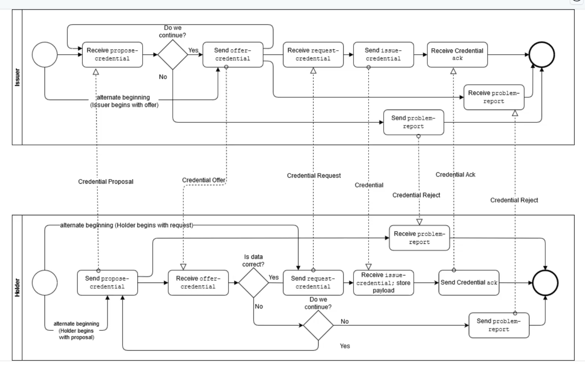
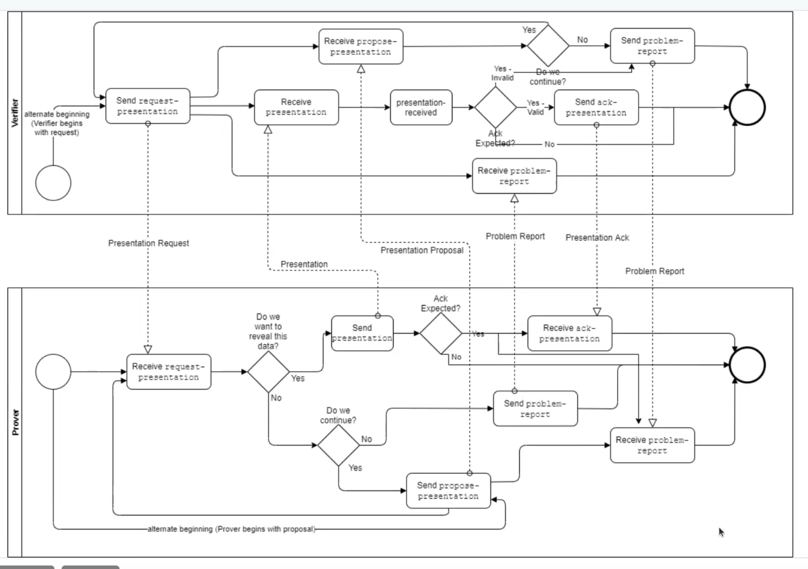

# 18/02 - 📜 Processo de Comunicação com DIDComm

## 📌 Índice
1. [Conexão entre Agentes](#conexão-entre-agentes)
2. [Emissão de Credencial](#emissão-de-credencial)
3. [Prova de Credencial](#prova-de-credencial)
4. [Transcrições de Reuniões](#📂-transcrições-de-reuniões)

## 🔗 Conexão entre Agentes

### 👥 Agentes Envolvidos:
- **Alice**
- **Bob**

### 🔄 Processo de Conexão:
1. **Alice envia um convite de conexão** contendo um DID associado a ela:
   - O agente de Alice cria um DID.
   - O DID contém um par de chaves que será usado para encriptação.
   - O DID é armazenado na wallet, contendo a chave privada.
   - A chave pública é enviada no convite (`recipient_key`) para o destinatário.

2. **Bob recebe o convite e cria um DID próprio**, adicionando sua chave pública e respondendo com a aceitação da conexão.
3. **Após a troca de mensagens**, ambos conhecem as chaves públicas um do outro.
4. **ACA-Py e Credo (por padrão) enviam uma mensagem de conexão OK**.
5. **Com a conexão estabelecida**, todas as mensagens futuras serão encriptadas.
6. **Os agentes utilizam os DIDs para comunicação segura**.
   - Como ambos possuem as chaves públicas, podem encriptar e decriptar mensagens.
   - Isso marca o início da **DIDComm**.

### 📡 Protocolo DIDComm
- Após a conexão, os agentes podem trocar mensagens.
- Se ambos os agentes possuem **IP fixo**, podem usar **Basic Message**:
  - Alice pega seu DID, encripta a mensagem e a envia via DIDComm para Bob.
  - Bob recebe a mensagem encriptada, decripta com seu DID e visualiza o conteúdo.
- A comunicação pode ser feita via **HTTP** ou **WebSocket**.

### 🏷️ Mediação
- **Implementação do processo de mediação**:
  - O Credo TS possui suporte, mas o Flutter não.
- **Cenário com IP fixo e variável**:
  - Enviar mensagem do Flutter para o emissor funciona pois o emissor tem IP fixo.
  - O retorno do emissor para o Flutter falha pois o Flutter não tem IP fixo.
  - Solução: **Uso de mediador**, que retransmite mensagens para o Flutter.

## 🎟️ Emissão de Credencial

### 🏢 Agentes Envolvidos:
- **Portador** (Dart)
- **Emissor** (ACA-Py)

### 🔁 Processo de Emissão:
1. O emissor deseja oferecer uma credencial e envia uma mensagem para o portador.
2. Se o portador (GovBR/Dart) não estiver aberto, o WebSocket não estará ativo.
3. O mediador gerencia a comunicação:
   - Se o WebSocket estiver aberto, envia a mensagem diretamente.
   - Caso contrário, coloca na fila e envia quando o WebSocket abrir.
4. O Dart se conecta ao mediador (ACA-Py).
5. O mediador mantém uma lista de conexões entre emissor e portador.
6. No envio da oferta:
   - O emissor pega o **CredDef** da carteira e insere os dados (ex: nome, e-mail).
   - A oferta é encriptada com a chave privada da **CredDef** (armazenada na carteira Askar do ACA-Py).
   - A oferta é enviada ao holder.
7. O holder decripta a mensagem e valida a oferta:
   - Verifica os dados na blockchain (Besu) e recupera o **CredDef** e o **Schema**.
   - O AnonCreds valida a estrutura da credencial.
   - Se a credencial for aceita, o holder envia um request para o emissor.
8. O emissor recebe a requisição, decripta e emite a credencial assinada.
9. O holder verifica a assinatura na blockchain e armazena na **Askar**.
10. O holder envia um **ACK** confirmando o recebimento da credencial.

### ⚠️ Tratamento de Erros
- Se houver erro nos dados, o **issuer** envia um `problem-report`.
- O `problem-report` também é encriptado via **DIDComm**.
- Toda a comunicação entre **portador e emissor** é segura e encriptada.

## 📜 Prova de Credencial

### 📖 Processo:
1. O **Prover** já possui uma credencial e deseja provar sua autenticidade ao **Verificador**.
2. A conexão entre os agentes já deve estar estabelecida.
3. O Verificador solicita uma **prova de credencial** específica (ex: nome, e-mail).
4. O Prover recebe a solicitação e decripta a mensagem:
   - Valida os dados na blockchain.
   - Verifica na carteira Askar se possui a credencial.
   - Decide se deseja revelar os dados.
5. Se aceitar:
   - Envia um `send_presentation`, contendo a CredDef.
   - Consulta a blockchain para verificar o status da credencial (se é revogável, consulta o registro de revogação).
   - Encapsula tudo e envia ao Verificador.
6. O Verificador recebe a apresentação e faz validações:
   - Confirma na blockchain o schema e a revogação.
   - Se tudo estiver correto, envia um **ACK-Presentation** confirmando a validação.

### ❌ Caso de Rejeição
- Se o Prover não deseja compartilhar a credencial:
  - No app Dart, o usuário pode recusar.
  - O Prover envia um `problem-report` ao Verificador, encerrando o processo.

