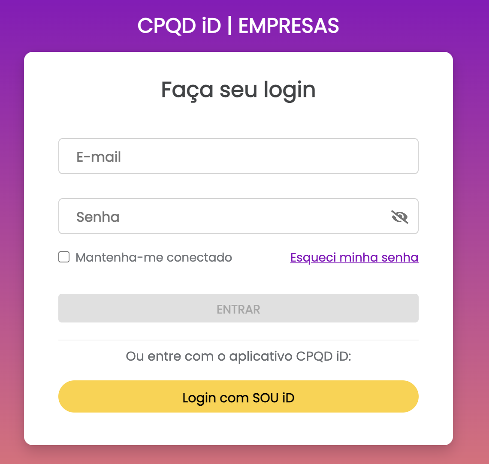
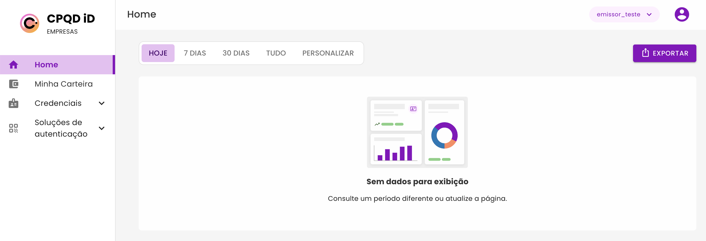
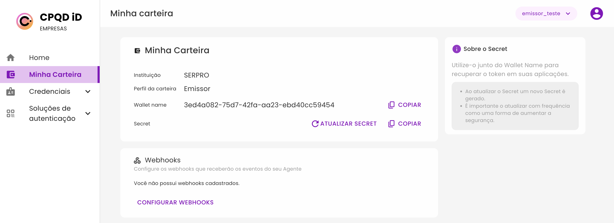
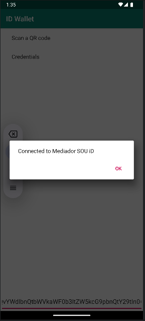
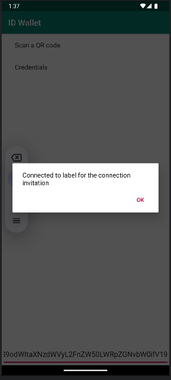
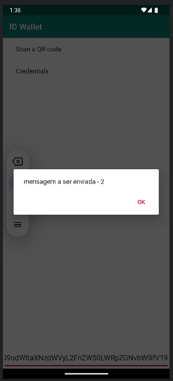
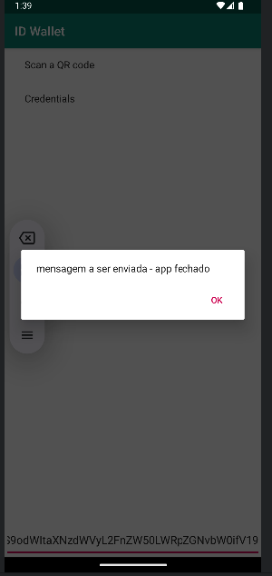
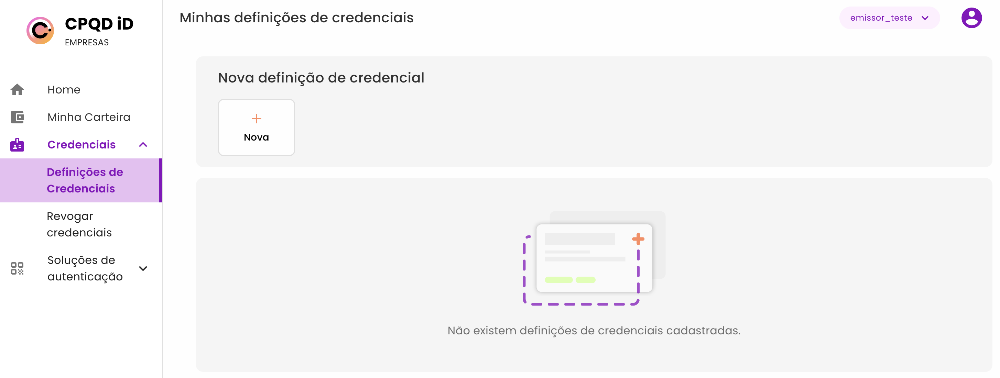

# 🚀 Acesso ao Staging

## 🔗 Portal de Empresas

Acesse o ambiente de staging para visualizar métricas de emissão, provas e outras informações essenciais:

🔗 **Link de acesso:** [Staging Portal Empresas](https://staging-id-besu.cpqd.com.br/empresas/)



---

## 📊 Métricas

No portal, você pode visualizar informações detalhadas sobre emissões, provas e demais métricas.

 

---

## 🎟️ Acesso à Carteira

Para visualizar os detalhes da sua carteira, como nome e secret (necessário para obter o token):

🔹 **Navegue até:** `Minha Carteira` <br>
🔹 **Nome da Carteira** e **Secret** disponíveis

 

---

## 🔑 Gerando Token do Emissor

Para autenticação no **Auth Manager**, utilize a chamada:

```bash
curl -X POST 'https://staging-id-besu.cpqd.com.br/api/auth-manager/v1/token' \
--header 'Content-Type: application/json' \
--data '{
    "wallet_name":"{{WALLET_NAME}}",
    "password":"{{SECRET}}"
}'
```

Com o token gerado, é possível criar convites de conexão e enviar ofertas de credenciais.

---

## 🌍 Conexão com Mediador

Caso seja necessário que o agente receba mensagens com o aplicativo fechado, é preciso conectar-se ao mediador.

🔗 **Convite do Agente Mediador:** [Acesso ao Mediador](https://blockchain.cpqd.com.br/cpqdid/agent-mediator-endpoint-com)

Após conexão, a seguinte tela deve ser exibida:



---

## ✉️ Criando um Convite de Conexão

```bash
curl -X POST 'https://staging-id-besu.cpqd.com.br/api/hub-issuer/agent/v2/out-of-band/create-invitation' \
--header 'Authorization: Bearer {{token}}' \
--header 'Content-Type: application/json' \
--data '{
    "alias": "alias for the connection",
    "my_label": "label for the connection invitation",
    "metadata": {},
    "handshake_protocols": [
        "https://didcomm.org/connections/1.0"
    ],
    "accept": [
        "didcomm/aip1",
        "didcomm/aip2;env=rfc19"
    ]
}'
```

Após a requisição, copie o `invitation_url` e gere um QR Code:

🔗 [Gerar QR Code](https://www.canva.com/qr-code-generator/)

📱 No celular, escaneie o QR Code para completar a conexão:



---

## 🔄 Obtendo Connection ID

```bash
curl -X GET 'https://staging-id-besu.cpqd.com.br/api/hub-issuer/agent/v2/connections?invitation_msg_id={{invi_msg_id}}' \
--header 'Authorization: Bearer {{token}}' \
--header 'Content-Type: application/json' \
--data ''
```

---

## 💬 Troca de Mensagens

```bash
curl -X POST 'https://staging-id-besu.cpqd.com.br/api/hub-issuer/agent/v2/connections/{{connection_id}}/send-message' \
--header 'Authorization: Bearer {{token}}' \
--header 'Content-Type: application/json' \
--data '{
    "content": "mensagem a ser enviada"
}'
```

📱 Com o aplicativo aberto, a mensagem será exibida:



Caso o app esteja fechado, ao abrir ele exibirá a mensagem:



---

## 📜 Emissão de Credencial

No portal, há a opção de criar **definições de credencial**, incluindo dados como **nome, e-mail e data de nascimento**.



---

## 🔗 Links Úteis

- 📚 [Documentação de Desenvolvimento](https://staging-id-besu.cpqd.com.br/docs/developerGuide.html)
- 🛠️ [Swagger API](https://staging-id-besu.cpqd.com.br/docs/swagger/?urls.primaryName=agent)
- 🏢 [Portal Empresas](https://staging-id-besu.cpqd.com.br/empresas)
- 🔄 [Convite do Agente Mediador](https://blockchain.cpqd.com.br/cpqdid/agent-mediator-endpoint-com)

---

## 🛠️ Environment e Collection (Postman)

- [🔗 Integrações com iD - Postman Collection](../utils/Integrações%20com%20iD.postman_collection.json)
- [🔗 Integrações iD - Postman Environment](../utils/Integrações%20iD.postman_environment.json)

🚀 *Mantenha este documento atualizado conforme novas funcionalidades forem adicionadas!*